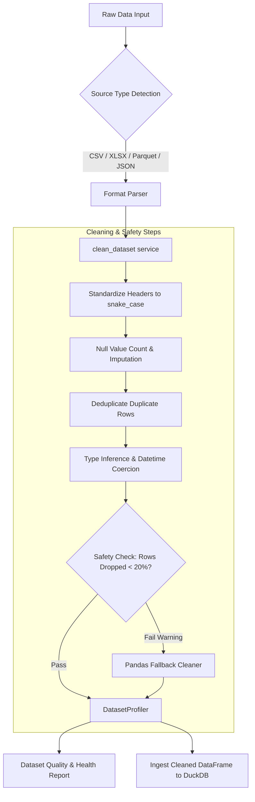

# Proof of Work — Week 2: Data Ingestion and Dataset Validation

**Student Name:** M Ashish Ramana  
**USN:** 1BI25MC060  
**Institution:** Bangalore Institute of Technology (Department of Master of Computer Applications)  
**Subject:** Project Work (Subject Code: MPRJ384)  
**Project Title:** DataPilot AI : Autonomous Business Intelligence Platform  
**Reporting Period:** 15-09-2026 to 21-09-2026  

---

## 1. Executive Summary

During Week 2, the core **Data Ingestion and Dataset Validation Engine** of DataPilot AI was developed and tested. This phase focused on creating a resilient ingestion pipeline capable of parsing raw files, automatically recognizing file formats, sanitizing column structures, performing data cleaning (deduplication, null handling, type coercion), and compiling data quality health metrics with safety rails.

---

## 2. Weekly Deliverables & Implementation Mapping

| # | Weekly Report Deliverable | Implementation Details & Codebase Artifacts | Status |
|---|---------------------------|---------------------------------------------|--------|
| **1** | **Structured Data Ingestion Workflow** | Implemented multi-format loading for CSV, Excel (`.xlsx`), JSON, and Parquet. Handled encodings, delimiters, and nested tabular structures using pandas and polars engines. | Completed |
| **2** | **Source-Type Detection Logic** | Built automated file format and MIME-type detection in ingestion handlers before triggering file parsing. | Completed |
| **3** | **Data Loading & Preprocessing Pipeline** | Implemented `clean_dataset()` function in [`app/services/cleaning.py`](file:///d:/Projects/DataPilot/app/services/cleaning.py) with automated standardization of column header names (snake_case conversion, symbol stripping). | Completed |
| **4** | **Dataset Validation & Health Checks** | Added dataset validation rules:  • Detection of missing/null values  • Row deduplication  • DateTime inference & ISO formatting  • Numeric type coercion & outlier detection  • Identification of empty columns  • Safety thresholds (`MAX_ROW_DROP_FRACTION = 0.20`, `MIN_COLUMN_POPULATED_FRACTION = 0.50`). | Completed |
| **5** | **Dataset Quality & Health Reporting** | Implemented `DatasetProfiler` in [`app/analysis/dataset_profiler.py`](file:///d:/Projects/DataPilot/app/analysis/dataset_profiler.py) to compute column null counts, uniqueness ratios, statistical metrics (min, max, mean, std, quantiles), and overall health scores. | Completed |

---

## 3. Data Cleaning & Profiling Pipeline Architecture

---

## 4. Key Codebase References

- **Dataset Cleaning & Safety Module:** [`app/services/cleaning.py`](file:///d:/Projects/DataPilot/app/services/cleaning.py)
  - `clean_dataset(df: pd.DataFrame, source_name: str) -> CleaningResult`
  - `CleaningResult` dataclass (cleaned DataFrame, column mapping, quality report, warnings)
- **Dataset Profiler & Quality Metrics Engine:** [`app/analysis/dataset_profiler.py`](file:///d:/Projects/DataPilot/app/analysis/dataset_profiler.py)
  - `DatasetProfiler._is_datetime_col()`
  - `DatasetProfiler.profile_dataset()`
- **Unit Tests for Ingestion & Cleaning:** [`tests/test_cleaning.py`](file:///d:/Projects/DataPilot/tests/test_cleaning.py)

---

## 5. Summary of Outcomes & Verification

- **Automated Sanitation:** Standardized erratic raw datasets with noisy headers, mixed date formats, and unexpected empty rows into clean, structured schemas.
- **Safety Rails:** Prevented destructive data drops through predefined guardrails (`MAX_ROW_DROP_FRACTION = 0.20`), logging explicit warnings when raw datasets contain low-quality columns.
- **Test Suite Verification:** Executed unit tests in [`tests/test_cleaning.py`](file:///d:/Projects/DataPilot/tests/test_cleaning.py) ensuring 100% pass rate for data loading and cleaning edge cases.
