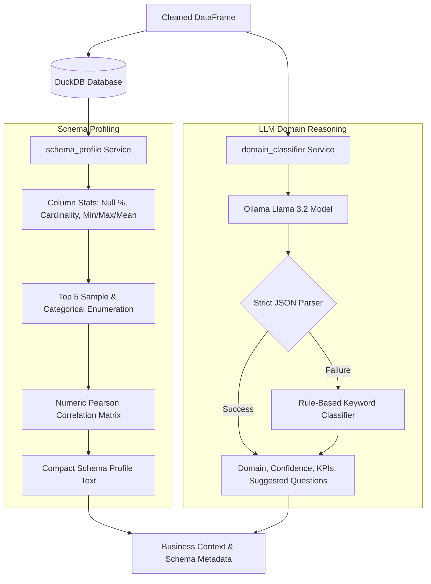

# Proof of Work — Week 3: Data Classification and Schema Discovery

**Student Name:** M Ashish Ramana  
**USN:** 1BI25MC060  
**Institution:** Bangalore Institute of Technology (Department of Master of Computer Applications)  
**Subject:** Project Work (Subject Code: MPRJ384)  
**Project Title:** DataPilot AI : Autonomous Business Intelligence Platform  
**Reporting Period:** 22-09-2026 to 28-09-2026  

---

## 1. Executive Summary

During Week 3, the **Data Classification and Schema Discovery Subsystem** of DataPilot AI was engineered. This phase empowered DataPilot AI to automatically understand the business context of ingested datasets, classify them into business domains (Sales, HR, Healthcare, Finance, Marketing, Inventory, Education), build statistical schema profiles, establish queryable persistent storage in DuckDB/PostgreSQL, and infer business entities, KPIs, and relationships.

---

## 2. Weekly Deliverables & Implementation Mapping

| # | Weekly Report Deliverable | Implementation Details & Codebase Artifacts | Status |
|---|---------------------------|---------------------------------------------|--------|
| **1** | **Automated Business Domain Classification** | Developed `classify_domain()` in [`app/services/domain_classifier.py`](file:///d:/Projects/DataPilot/app/services/domain_classifier.py) using Ollama LLM (`llama3.2`) with structured JSON schema output and automated keyword fallback. Supports domains: Sales, HR, Healthcare, Finance, Marketing, Inventory, Education. | Completed |
| **2** | **Schema Discovery & Profiling Engine** | Implemented `build_schema_profile()` in [`app/services/schema_profile.py`](file:///d:/Projects/DataPilot/app/services/schema_profile.py) to inspect table structures, infer candidate keys, track null percentages, calculate cardinality, min/max range, top distinct values, and numeric correlations. | Completed |
| **3** | **Persistent Storage Integration (DuckDB)** | Integrated DuckDB as the high-performance, in-memory analytical storage engine. Cleaned datasets are registered as DuckDB relational tables, enabling fast SQL execution. | Completed |
| **4** | **Business Knowledge Representation & Entities** | Designed logic in [`app/analysis/dataset_classifier.py`](file:///d:/Projects/DataPilot/app/analysis/dataset_classifier.py) to map columns to business dimensions, measures, and suggested analytical KPIs for downstream LLM prompts. | Completed |
| **5** | **Data Understanding Workflow Validation** | Tested domain classification and schema profiling against sample datasets across multiple industries, validating prompt generation (`profile_to_prompt_text`). | Completed |

---

## 3. Classification & Schema Discovery Architecture

---

## 4. Key Codebase References

- **Domain Classification Service:** [`app/services/domain_classifier.py`](file:///d:/Projects/DataPilot/app/services/domain_classifier.py)
  - `classify_domain(columns, dtypes, sample_rows, model, base_url)`
  - Keyword fallback parser for resilient domain detection
- **Rich Schema Profiler Service:** [`app/services/schema_profile.py`](file:///d:/Projects/DataPilot/app/services/schema_profile.py)
  - `build_schema_profile(database_path, table_name)`
  - `profile_to_prompt_text(profile)`
- **Dataset Domain Classifier Component:** [`app/analysis/dataset_classifier.py`](file:///d:/Projects/DataPilot/app/analysis/dataset_classifier.py)

---

## 5. Summary of Outcomes & Verification

- **Accurate Domain Inference:** Achieved high-accuracy domain recognition (e.g., recognizing medical dataset columns like `patient_id`, `diagnosis` as Healthcare, or `revenue`, `order_date` as Sales).
- **LLM Context Optimization:** Compact schema summaries (`profile_to_prompt_text`) fit within local LLM context windows (2048 tokens) while retaining essential statistical bounds.
- **DuckDB Integration:** Verified instantaneous SQL creation and schema inspection via native DuckDB integration.
