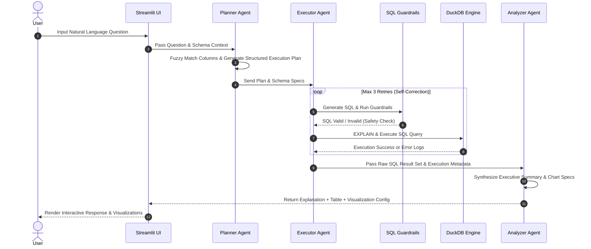

# Proof of Work — Week 4: Natural Language Query and Agent Development

**Student Name:** M Ashish Ramana  
**USN:** 1BI25MC060  
**Institution:** Bangalore Institute of Technology (Department of Master of Computer Applications)  
**Subject:** Project Work (Subject Code: MPRJ384)  
**Project Title:** DataPilot AI : Autonomous Business Intelligence Platform  
**Reporting Period:** 29-09-2026 to 06-10-2026  

---

## 1. Executive Summary

During Week 4, the **Multi-Agent Natural Language Analytics Workflow** for DataPilot AI was engineered and implemented. This phase introduced the core agentic reasoning engine consisting of the **Planner Agent**, **Executor Agent** (with self-correction and strict SQL guardrails), and **Analyzer Agent** (natural language response synthesis and visualization staging).

---

## 2. Weekly Deliverables & Implementation Mapping

| # | Weekly Report Deliverable | Implementation Details & Codebase Artifacts | Status |
|---|---------------------------|---------------------------------------------|--------|
| **1** | **Natural Language Analytics Workflow** | Built end-to-end question-to-answer loop connecting user prompts in Streamlit interface to DuckDB query execution. Supported follow-up questions via `rewrite_followup()` in [`app/services/query_rewriter.py`](file:///d:/Projects/DataPilot/app/services/query_rewriter.py). | Completed |
| **2** | **Planner Agent Design & Implementation** | Created [`PlannerAgent`](file:///d:/Projects/DataPilot/app/agents/planner.py) to parse natural language questions into structured execution plans (intent, target tables, required columns, filters, aggregation strategy, fuzzy matching with `rapidfuzz`). | Completed |
| **3** | **Executor Agent & SQL Generation** | Created [`ExecutorAgent`](file:///d:/Projects/DataPilot/app/agents/executor.py) to convert execution plans into DuckDB SQL queries. Features a 3-attempt self-correction loop, few-shot prompt injection (`examples.yaml`), and strict syntax validation (`EXPLAIN`). | Completed |
| **4** | **Query Execution & Result Handling** | Implemented query execution with strict AST/RegEx SQL safety rails (`validate_sql` in [`app/services/sql_guardrails.py`](file:///d:/Projects/DataPilot/app/services/sql_guardrails.py)) blocking destructive statements (`DROP`, `DELETE`, `INSERT`, `ALTER`, multi-statement injection). Structured dataframes into clean JSON results. | Completed |
| **5** | **Analyzer Agent & Visualization Preparation** | Implemented [`AnalyzerAgent`](file:///d:/Projects/DataPilot/app/agents/analyzer.py) to interpret raw SQL query results, generate human-readable analytical summaries, and produce visualization specifications (chart type, x/y axes, color encoding) for rendering. | Completed |

---

## 3. Multi-Agent System Architecture

---

## 4. Key Codebase References

- **Planner Agent:** [`app/agents/planner.py`](file:///d:/Projects/DataPilot/app/agents/planner.py)
  - `PlannerAgent.run(state)`
  - Schema-constrained intent & column extraction using RapidFuzz
- **Executor Agent & Self-Correction:** [`app/agents/executor.py`](file:///d:/Projects/DataPilot/app/agents/executor.py)
  - `ExecutorAgent.run(state)`
  - Self-correction loop (`MAX_RETRIES = 3`) with `EXPLAIN` query validation
- **Analyzer Agent & Response Synthesis:** [`app/agents/analyzer.py`](file:///d:/Projects/DataPilot/app/agents/analyzer.py)
  - `AnalyzerAgent.run(state)`
- **SQL Security Guardrails:** [`app/services/sql_guardrails.py`](file:///d:/Projects/DataPilot/app/services/sql_guardrails.py)
  - `validate_sql(sql)` preventing SQL injection & non-SELECT statements
- **Unit & Guardrail Tests:** [`tests/test_guardrails.py`](file:///d:/Projects/DataPilot/tests/test_guardrails.py), [`tests/test_auto_analysis.py`](file:///d:/Projects/DataPilot/tests/test_auto_analysis.py)

---

## 5. Summary of Outcomes & Verification

- **Resilient Query Generation:** The self-correction loop handles syntax mismatches or column name typos seamlessly before returning answers to the user.
- **SQL Security Guardrails:** Verified zero tolerance for destructive queries (e.g., blocking `DROP TABLE`, `UPDATE`, or SQL injection strings).
- **End-to-End Test Suite:** Ran unit tests in [`tests/test_guardrails.py`](file:///d:/Projects/DataPilot/tests/test_guardrails.py) and [`tests/test_auto_analysis.py`](file:///d:/Projects/DataPilot/tests/test_auto_analysis.py) confirming valid SQL generation and multi-agent execution pipeline stability.
